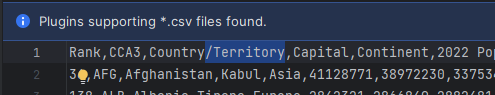

## Инструкция по запуску:
1. Запустите файл [create_db.py](C:\Users\kravc\OneDrive\Рабочий стол\KTS\data_analysis\database\create_db.py)
2. Скопируйте _csv_ файл по пути, который будет указан в консоли
3. Вставьте файл в папку _data_ проекта

4. В _csv_ файле удалите
